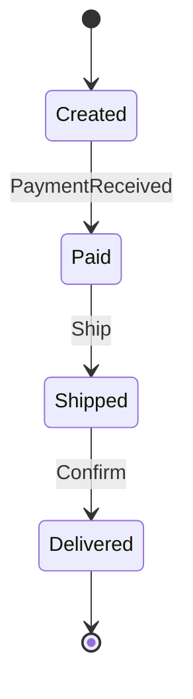

# typed-fsm Development Roadmap

## Project Overview

**typed-fsm** is a lightweight, zero-cost, event-driven finite state machine microframework for Rust. This document outlines the development roadmap from initial release through advanced features.

---

## Development Phases

### Phase 1: Basic (v0.1.0) - COMPLETED

**Status:** Released January 2025

**Features:**
- Core `state_machine!` macro with declarative DSL
- Lifecycle hooks: `entry`, `process`, and `exit`
- Stateful states with typed data fields
- Type-safe state transitions with `Transition<S>` enum
- Zero-cost abstraction with static dispatch
- `#![no_std]` compatibility for embedded systems
- Comprehensive test suite (30+ tests, ~100% coverage)

**Examples:**
- Motor control system with safety checks
- Traffic light controller

---

### Phase 2: Intermediate (v0.2.0) - COMPLETED

**Status:** Released January 2025

**Features:**
- Thread safety and concurrency support
  - Automatic `Send + Sync` for FSMs
  - `Arc<Mutex<>>` pattern documentation
  - 2 new concurrency integration tests
- Hierarchical FSMs (compositional pattern)
  - Nested state machines in context
- Enhanced documentation
  - Honest comparison with alternatives (statig, smlang, rust-fsm)
  - Async usage patterns
  - "When to Choose Each" guidance

**Examples:**
- `blink.rs` - Simplest possible FSM
- `hierarchical.rs` - Nested state machines (audio player)
- `traffic_intersection.rs` - 3 concurrent FSMs

---

### Phase 3: Advanced (Planned)

**Status:** Future development

This phase introduces advanced FSM features found in mature state machine frameworks while maintaining typed-fsm's core principles: zero-cost abstraction, no_std compatibility, and type safety.

---

## Advanced Features

### 1. Guards (Conditional Transitions)

**Description:**
Guards are boolean conditions that must evaluate to true for a state transition to occur. They act as gatekeepers, validating data or checking preconditions before allowing state changes.

**Use Cases:**
- Input validation before state transitions
- Security checks (PIN verification, authentication)
- Resource availability checks
- Business rule enforcement

**Example - ATM PIN Verification:**
```rust
state_machine! {
    Name: ATM,
    Context: ATMContext,
    Event: ATMEvent,

    States: {
        WaitingPIN => {
            process: |ctx, evt| {
                match evt {
                    ATMEvent::EnterPIN { pin } => {
                        // Guard: verify PIN is correct
                        if ctx.verify_pin(*pin) {
                            Transition::To(ATM::Authenticated)
                        } else {
                            ctx.attempts += 1;

                            // Guard: block after 3 failed attempts
                            if ctx.attempts >= 3 {
                                Transition::To(ATM::Blocked)
                            } else {
                                Transition::None
                            }
                        }
                    }
                }
            }
        }
    }
}
```

**Technical Details:**
- **Priority:** High
- **Complexity:** Low (already works in current implementation)
- **no_std:** Yes
- **Zero-cost:** Yes

**Implementation Note:**
Guards already work in typed-fsm through conditional logic in `process` blocks. Future enhancement could add declarative syntax sugar.

---

### 2. History States

**Description:**
History states allow a state machine to remember which substate was active before exiting a composite state, and return to that specific substate when re-entering.

**Types:**
- **Shallow History:** Remembers only one level of nesting
- **Deep History:** Remembers all levels of nested substates

**Use Cases:**
- Pause/resume functionality
- Temporary interruptions
- "Return where you left off" behavior
- Context preservation across state transitions

**Example - Media Player:**
```rust
// State hierarchy:
Playing {
    NormalSpeed,    // 1x playback
    FastForward,    // 2x playback
    SlowMotion      // 0.5x playback
}
Paused

// Scenario:
// 1. User is in Playing::FastForward (2x speed)
// 2. Phone call arrives -> Pauses (transitions to Paused)
// 3. Call ends -> Resumes

// Without history:
//   Returns to Playing::NormalSpeed (default)
//   Lost the 2x speed setting

// With shallow history:
//   Returns to Playing::FastForward
//   Preserves the 2x speed setting
```

**Conceptual Implementation:**
```rust
state_machine! {
    Name: MediaPlayer,
    Context: PlayerContext,
    Event: PlayerEvent,

    States: {
        Playing => {
            history: shallow,  // Remember last substate

            substates: {
                NormalSpeed => { ... },
                FastForward => { ... },
                SlowMotion => { ... }
            }
        },

        Paused => {
            entry: |ctx| {
                ctx.save_playing_state();
            }

            process: |ctx, evt| {
                match evt {
                    PlayerEvent::Resume => {
                        // Return to last Playing substate
                        Transition::To(MediaPlayer::Playing::History)
                    }
                }
            }
        }
    }
}
```

**Technical Details:**
- **Priority:** Medium
- **Complexity:** High
- **no_std:** Yes
- **Zero-cost:** Yes (requires state storage)

---

### 3. Timeout/Timer States

**Description:**
States that automatically transition after a specified time duration. Essential for implementing timeouts, retries with delays, and time-based behaviors.

**Use Cases:**
- Connection timeouts
- Retry mechanisms with exponential backoff
- Button debouncing
- Watchdog timers in embedded systems
- Session expiration

**Example - WiFi Connection with Retry:**
```rust
state_machine! {
    Name: WiFi,
    Context: WiFiContext,
    Event: WiFiEvent,

    States: {
        Connecting => {
            timeout: 10000ms,  // 10 second timeout

            on_timeout: |ctx| {
                ctx.log("Connection timeout");
                Transition::To(WiFi::Failed)
            }

            process: |ctx, evt| {
                match evt {
                    WiFiEvent::Connected => {
                        // Success before timeout
                        Transition::To(WiFi::Active)
                    }
                    _ => Transition::None
                }
            }
        },

        Failed => {
            timeout: 5000ms,  // Wait 5s before retry

            on_timeout: |ctx| {
                ctx.retry_count += 1;
                if ctx.retry_count < 3 {
                    Transition::To(WiFi::Connecting)
                } else {
                    ctx.log("Max retries exceeded");
                    Transition::None
                }
            }
        }
    }
}
```

**Technical Details:**
- **Priority:** High
- **Complexity:** Medium
- **no_std:** Partial (requires timer abstraction)
- **Zero-cost:** Yes

**Implementation Considerations:**
- In `no_std` environments, user must provide timer abstraction
- Compatible with embedded timer peripherals
- No heap allocations required

---

### 4. Deferred Events (Event Queue)

**Description:**
Mechanism to queue events for later processing when the current state cannot handle them immediately. Prevents event loss during critical operations.

**Use Cases:**
- State busy with critical operation
- Ordered event processing
- Buffering during state transitions
- Resource contention handling

**Example - File System Write Queue:**
```rust
state_machine! {
    Name: FileSystem,
    Context: FSContext,
    Event: FSEvent,

    States: {
        Idle => {
            process: |ctx, evt| {
                match evt {
                    FSEvent::Write { data } => {
                        Transition::To(FileSystem::Writing { data })
                    }
                }
            }
        },

        Writing { data } => {
            entry: |ctx| {
                ctx.start_write_operation();
            }

            process: |ctx, evt| {
                match evt {
                    // Another write arrives during current write
                    FSEvent::Write { data } => {
                        // Cannot process now - defer it
                        ctx.defer_event(evt);
                        Transition::None
                    }

                    FSEvent::WriteComplete => {
                        // Current write complete, process queued events
                        if let Some(deferred) = ctx.pop_deferred() {
                            self.dispatch(ctx, &deferred);
                        }
                        Transition::To(FileSystem::Idle)
                    }
                }
            }
        }
    }
}
```

**Technical Details:**
- **Priority:** Medium
- **Complexity:** High
- **no_std:** Partial (requires queue - Vec or heapless::Vec)
- **Zero-cost:** Approximates (depends on queue implementation)

---

### 5. Actions (Side Effects)

**Description:**
Named functions executed during state transitions, separated from state logic. Provides declarative syntax for common operations.

**Use Cases:**
- Reusable transition logic
- Clear separation of concerns
- More declarative DSL
- Logging and auditing

**Example - Motor Control:**
```rust
// Current approach (verbose but explicit):
Idle => {
    process: |ctx, evt| {
        match evt {
            Event::Start => {
                ctx.start_motor();
                ctx.log("Motor started");
                Transition::To(Motor::Running)
            }
        }
    }
}

// With Actions (declarative syntax sugar):
state_machine! {
    Name: Motor,
    Context: MotorContext,
    Event: MotorEvent,

    Actions: {
        fn start_motor(ctx: &mut MotorContext) {
            ctx.start_motor();
            ctx.log("Motor started");
        }

        fn stop_motor(ctx: &mut MotorContext) {
            ctx.stop_motor();
            ctx.log("Motor stopped");
        }
    }

    States: {
        Idle + Start / start_motor => Running,
        Running + Stop / stop_motor => Idle
    }
}
```

**Technical Details:**
- **Priority:** Low
- **Complexity:** Low
- **no_std:** Yes
- **Zero-cost:** Yes

---

### 6. Parallel/Orthogonal States

**Description:**
Multiple independent state machines running simultaneously but coordinated. Each orthogonal region has its own active state.

**Use Cases:**
- Systems with independent subsystems (robotics)
- Complex UI with multiple regions
- Concurrent activities management

**Example - Robot with Independent Subsystems:**
```rust
state_machine! {
    Name: Robot,
    Context: RobotContext,
    Event: RobotEvent,

    // Two orthogonal (parallel) regions
    Regions: {
        // Region 1: Locomotion
        Movement: {
            Idle,
            Walking,
            Running
        },

        // Region 2: Arm manipulation (independent)
        Arm: {
            Retracted,
            Extended,
            Gripping
        }
    }
}

// Valid simultaneous states:
// - Walking + Retracted (walking with arm retracted)
// - Running + Gripping (running while holding object)
// - Idle + Extended (stationary with arm extended)
```

**Technical Details:**
- **Priority:** Low
- **Complexity:** Very High
- **no_std:** Yes
- **Zero-cost:** Approximates (state storage overhead)

**Warning:** Adds significant complexity. May conflict with typed-fsm's simplicity goal.

---

### 7. Logging & Debugging

**Description:**
Automatic instrumentation that logs all state transitions, entry/exit actions, and guard evaluations for debugging and auditing.

**Use Cases:**
- Debugging complex state machines
- Production audit trails
- Behavioral analysis
- Security compliance logging

**Example - Payment System with Logging:**
```rust
#[derive(Debug)]
#[fsm(log)]  // Enable automatic logging
state_machine! {
    Name: PaymentFSM,
    Context: PaymentContext,
    Event: PaymentEvent,

    States: {
        Pending => { ... },
        Processing => { ... },
        Completed => { ... }
    }
}
```

**Automatic Log Output:**
```
[2025-01-22 15:30:45] PaymentFSM: init() -> Pending
[2025-01-22 15:30:46] PaymentFSM: Pending + ProcessPayment(100.00)
[2025-01-22 15:30:46] PaymentFSM:   guard: amount > 0 -> true
[2025-01-22 15:30:46] PaymentFSM:   Pending.exit()
[2025-01-22 15:30:46] PaymentFSM:   Processing.entry()
[2025-01-22 15:30:46] PaymentFSM: -> Processing
[2025-01-22 15:30:50] PaymentFSM: Processing + PaymentComplete
[2025-01-22 15:30:50] PaymentFSM:   Processing.exit()
[2025-01-22 15:30:50] PaymentFSM:   Completed.entry()
[2025-01-22 15:30:50] PaymentFSM: -> Completed
```

**Technical Details:**
- **Priority:** High
- **Complexity:** Low
- **no_std:** Partial (requires log facade)
- **Zero-cost:** Yes (zero-cost when disabled)

**Implementation Options:**
- `log` crate integration
- `tracing` crate integration
- Custom logging trait
- Feature-gated (opt-in)

---

### 8. Serialization (Snapshot/Restore)

**Description:**
Ability to serialize the current state machine state to persistent storage and restore it later. Essential for checkpointing and crash recovery.

**Use Cases:**
- Game save/load
- Session persistence
- Checkpoint in long-running processes
- Crash recovery
- State migration

**Example - Game Save System:**
```rust
use serde::{Serialize, Deserialize};

#[derive(Serialize, Deserialize)]
state_machine! {
    Name: GameFSM,
    Context: GameContext,
    Event: GameEvent,

    States: {
        MainMenu,
        Playing { level: u32, score: u32 },
        Paused { level: u32, score: u32 },
        GameOver
    }
}

// Save game state
fn save_game(game: &GameFSM, ctx: &GameContext) -> Result<(), Error> {
    let snapshot = SaveData {
        fsm_state: game.clone(),
        context: ctx.clone(),
        timestamp: now(),
    };

    let json = serde_json::to_string(&snapshot)?;
    std::fs::write("savegame.json", json)?;
    Ok(())
}

// Load game state
fn load_game() -> Result<(GameFSM, GameContext), Error> {
    let json = std::fs::read_to_string("savegame.json")?;
    let snapshot: SaveData = serde_json::from_str(&json)?;
    Ok((snapshot.fsm_state, snapshot.context))
}
```

**Technical Details:**
- **Priority:** Medium
- **Complexity:** Medium
- **no_std:** No (requires serde, optional)
- **Zero-cost:** Yes (when not used)

**Implementation:**
- Automatic `Serialize`/`Deserialize` derive
- Feature-gated behind `serde` feature
- Works with JSON, bincode, etc.

---

### 9. Diagram Generation

**Description:**
Automatically generate visual state machine diagrams from the FSM definition. Useful for documentation and validation.

**Supported Formats:**
- Mermaid (markdown-compatible)
- Graphviz DOT
- PlantUML

**Use Cases:**
- Automatic documentation
- Onboarding new developers
- Design validation with stakeholders
- Detecting dead states or unreachable transitions

**Example:**
```rust
#[derive(Diagram)]
state_machine! {
    Name: OrderFSM,
    Context: OrderContext,
    Event: OrderEvent,

    States: {
        Created => { ... },
        Paid => { ... },
        Shipped => { ... },
        Delivered => { ... }
    }
}

// Generate Mermaid diagram
let mermaid = OrderFSM::generate_mermaid();
println!("{}", mermaid);
```

**Output (Mermaid):**


**Technical Details:**
- **Priority:** Low
- **Complexity:** Medium
- **no_std:** No
- **Zero-cost:** Yes (compile-time generation)

**Integration:**
- Can integrate with `cargo doc`
- CI/CD pipeline for automated diagram updates
- Feature-gated

---

### 10. Async Native Support

**Description:**
Allow `async fn` syntax in lifecycle hooks (entry, process, exit) for asynchronous I/O operations.

**Use Cases:**
- Database queries
- Network requests
- File I/O
- Integration with async runtimes (tokio, async-std)

**Example - HTTP Connection Handler:**
```rust
#[cfg(feature = "async")]
state_machine! {
    Name: HTTPConnection,
    Context: ConnContext,
    Event: ConnEvent,

    States: {
        Idle => {
            async process: |ctx, evt| {
                match evt {
                    ConnEvent::Request { req } => {
                        // Async database query
                        let user = ctx.db.fetch_user(req.user_id).await?;

                        if user.is_authenticated() {
                            Transition::To(HTTPConnection::Authenticated { user })
                        } else {
                            Transition::To(HTTPConnection::Unauthorized)
                        }
                    }
                }
            }
        },

        Authenticated { user } => {
            async entry: |ctx| {
                // Async logging
                ctx.logger.log_auth(&user).await;

                // Async notification
                ctx.notify_user_online(user.id).await;
            }

            async process: |ctx, evt| {
                match evt {
                    ConnEvent::Logout => {
                        // Async cleanup
                        ctx.db.update_last_seen(user.id).await;
                        Transition::To(HTTPConnection::Idle)
                    }
                }
            }
        }
    }
}
```

**Technical Details:**
- **Priority:** Medium
- **Complexity:** High
- **no_std:** No (requires async runtime)
- **Zero-cost:** No (async overhead)

**Trade-offs:**
- Requires async runtime (tokio, async-std, smol)
- Adds complexity and overhead
- Not compatible with no_std
- Breaks zero-cost abstraction principle

**Implementation:**
- Feature-gated behind `async` feature
- Optional dependency on async runtime
- Maintains synchronous API as default

---

## Feature Comparison Matrix

| Feature | Priority | Complexity | no_std | Zero-cost | Utility |
|---------|----------|------------|---------|-----------|---------|
| Guards | High | Low | Yes | Yes | 5/5 |
| History States | Medium | High | Yes | Yes | 4/5 |
| Timeouts | High | Medium | Partial | Yes | 5/5 |
| Deferred Events | Medium | High | Partial | Approx | 3/5 |
| Actions | Low | Low | Yes | Yes | 3/5 |
| Parallel States | Low | Very High | Yes | Approx | 2/5 |
| Logging | High | Low | Partial | Yes | 5/5 |
| Serialization | Medium | Medium | No | Yes | 4/5 |
| Diagrams | Low | Medium | No | Yes | 3/5 |
| Async Support | Medium | High | No | No | 4/5 |

**Legend:**
- **Partial:** Requires optional dependencies or abstractions
- **Approx:** Close to zero-cost but not guaranteed
- **Utility:** Rated 1-5 for general usefulness

---

## Suggested Version Roadmap

### v0.3.0 - Guards & Logging
**Timeline:** Q1 2025

**Features:**
- Improve guards documentation
- Add logging/tracing integration
- Macro attribute `#[fsm(log)]`
- Example: Payment system with audit trail

**Goals:**
- Better debugging experience
- Production-ready logging
- No breaking changes

---

### v0.4.0 - Timers & Deferred Events
**Timeline:** Q2 2025

**Features:**
- Timeout states with timer abstraction
- Event queue/defer mechanism
- Example: WiFi connection with retry
- Example: Button debouncing

**Goals:**
- Essential embedded features
- Maintain no_std compatibility
- Zero heap allocations

---

### v0.5.0 - History & Serialization
**Timeline:** Q3 2025

**Features:**
- Shallow history states
- Serde support (feature flag)
- Snapshot/restore functionality
- Example: Game save/load system

**Goals:**
- Enhanced state management
- Optional std features
- Backward compatibility

---

### v0.6.0 - Advanced Features
**Timeline:** Q4 2025

**Features:**
- Diagram generation (feature flag)
- Deep history (if needed)
- Performance benchmarks
- Documentation improvements

**Goals:**
- Visualization tools
- Production-ready advanced features
- Comprehensive examples

---

### v1.0.0 - Stable Release
**Timeline:** 2026

**Features:**
- Stable API guarantee
- Async native support (optional)
- Complete documentation
- Comprehensive example suite
- Production-ready for all use cases

**Goals:**
- API stability commitment
- Long-term support
- Industry adoption

---

## Prioritization Strategy

### MVP (Minimum Viable Product)
**Target:** v0.3.0

Essential features for production use:
1. **Guards** - Already works, improve documentation
2. **Logging** - Critical for debugging and audit
3. **Timeouts** - Essential for embedded and network code

### Nice to Have
**Target:** v0.4.0 - v0.5.0

Enhances developer experience:
4. **Serialization** - Useful for stateful applications
5. **History States** - Improves UX for pause/resume
6. **Deferred Events** - Handles specific edge cases

### Advanced
**Target:** v0.6.0+

Advanced features for specialized use cases:
7. **Diagrams** - Documentation and visualization
8. **Async** - Modern async/await integration
9. **Actions** - Syntactic sugar for cleaner DSL
10. **Parallel States** - Complex hierarchical systems

---

## Technical Considerations

### Maintaining Core Principles

**Zero-Cost Abstraction:**
- All features must compile to efficient code
- No runtime overhead when features not used
- Feature flags for optional functionality

**no_std Compatibility:**
- Core FSM functionality remains no_std
- Optional features may require std
- Clear documentation of requirements

**Type Safety:**
- Compile-time validation of transitions
- No runtime type checks
- Exhaustive pattern matching

**Zero Dependencies:**
- Core library has zero dependencies
- Optional features may add optional dependencies
- All dependencies feature-gated

### Implementation Guidelines

**Feature Flags:**
```toml
[features]
default = []
logging = ["log"]
tracing = ["tracing"]
async = ["futures"]
serde = ["serde", "serde_json"]
diagrams = []
```

**Backward Compatibility:**
- Additive changes only
- Deprecation warnings before removal
- Semantic versioning strictly followed

---

## Contributing

We welcome contributions to implement these advanced features. Please:

1. Open an issue to discuss the feature before implementation
2. Follow the implementation guidelines above
3. Maintain no_std compatibility where possible
4. Add comprehensive tests
5. Update documentation
6. Add examples demonstrating the feature

See [CONTRIBUTING.md](CONTRIBUTING.md) for detailed guidelines.

---

## Conclusion

This roadmap provides a clear path for evolving typed-fsm from a solid foundation (v0.2.0) to a comprehensive, production-ready FSM framework (v1.0.0) while maintaining its core principles of zero-cost abstraction, type safety, and no_std compatibility.

Each feature has been carefully evaluated for utility, complexity, and alignment with project goals. The phased approach allows for incremental development and community feedback.

For questions or suggestions about this roadmap, please open an issue on GitHub.
